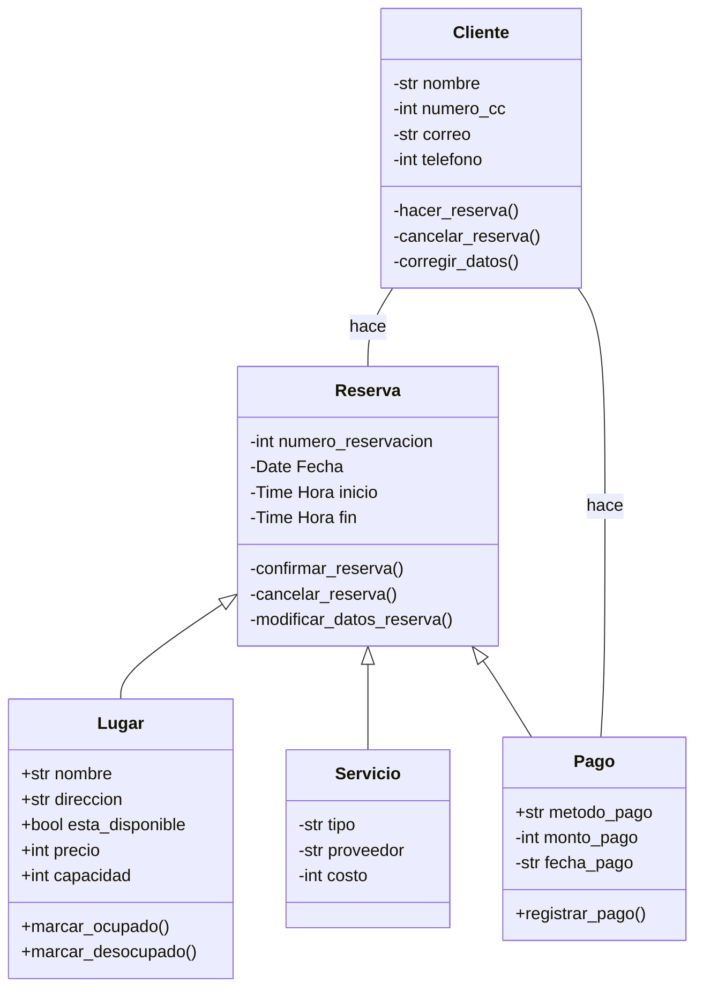

# Reto2_POO
### Katherine Restrepo
Elija un problema de la vida real (sistema de gestion de biblioteca, negocio de compra-venta, automovil, etc) que se pueda modelar a traves de objetos y clases. Plantee las relaciones de clases, composiciones, propiedades y comportamientos del sistema en uno mas diagramas tipo UML.

